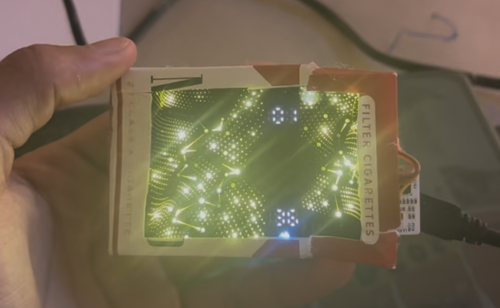

Main project code is under src/lights.cpp. Upload.cpp is a program to test pixels in the array

Hazy constellations is a desktop clock that consists of a recycled ecigarette LED array housed in a cigarette box. As the LED array diffuses randomly, showing twinkling stars and constellations, a user is reminded of the beauty of the night sky and the smoke pollution damaging the environment.

The LED array was removed from a trashed eciggarette and reused for this project. It uses a SPI bus and 3.3v power. Reverse engineering the communication lines from the original hardware allows control of all 138 individual pixels through an ESP32 based board. This project also utilizes a DS3231 real time clock module to track time reliably after powering off.
